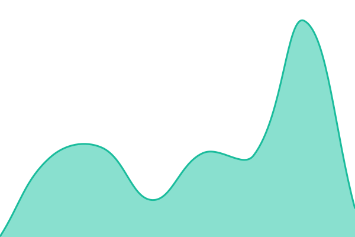
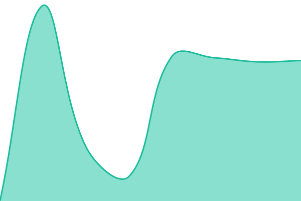
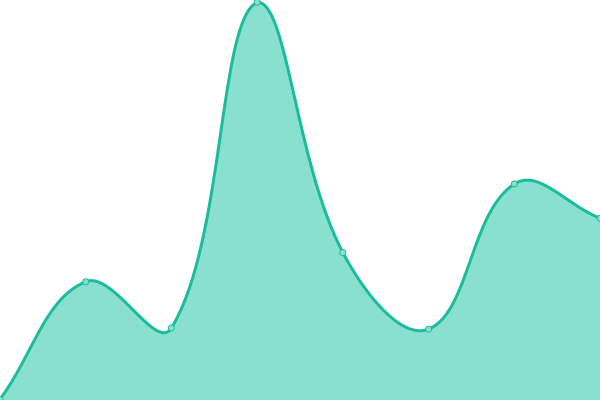
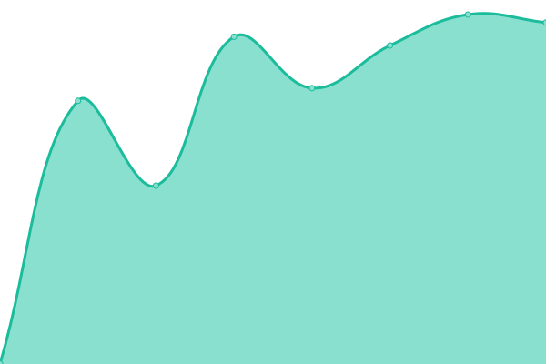
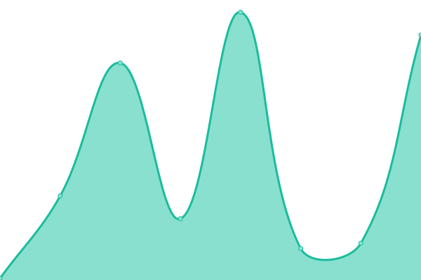
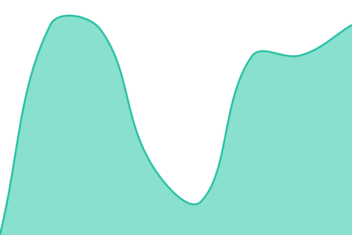
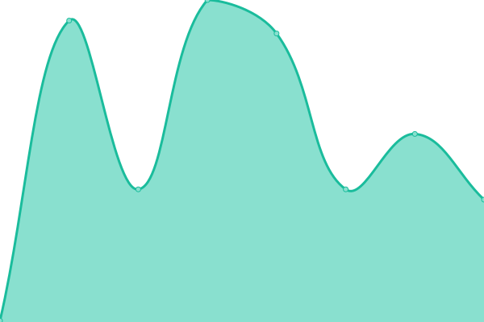

# [📈 Live Status](https://status.wookingwoo.com): <!--live status--> **🟩 All systems operational**

This repository contains the open-source uptime monitor and status page for [JeongHeon Woo](https://wookingwoo.com), powered by [Upptime](https://github.com/upptime/upptime).

With [Upptime](https://upptime.js.org), you can get your own unlimited and free uptime monitor and status page, powered entirely by a GitHub repository. We use [Issues](https://github.com/wookingwoo/upptime/issues) as incident reports, [Actions](https://github.com/wookingwoo/upptime/actions) as uptime monitors, and [Pages](https://status.wookingwoo.com) for the status page.

<!--start: status pages-->
<!-- This summary is generated by Upptime (https://github.com/upptime/upptime) -->
<!-- Do not edit this manually, your changes will be overwritten -->
<!-- prettier-ignore -->
| URL | Status | History | Response Time | Uptime |
| --- | ------ | ------- | ------------- | ------ |
|  [wookingwoo.com](https://wookingwoo.com) | 🟩 Up | [wookingwoo-com.yml](https://github.com/wookingwoo/upptime/commits/HEAD/history/wookingwoo-com.yml) | 

 178ms
     
 | 

<a href="https://status.wookingwoo.com/history/wookingwoo-com">100.00%</a>
    

|  [jjambot-website](https://jjambot.wookingwoo.com) | 🟩 Up | [jjambot-website.yml](https://github.com/wookingwoo/upptime/commits/HEAD/history/jjambot-website.yml) | 

 557ms
     
 | 

<a href="https://status.wookingwoo.com/history/jjambot-website">100.00%</a>
    

|  [smartwork](https://smartwork.wookingwoo.com) | 🟩 Up | [smartwork.yml](https://github.com/wookingwoo/upptime/commits/HEAD/history/smartwork.yml) | 

 731ms
     
 | 

<a href="https://status.wookingwoo.com/history/smartwork">100.00%</a>
    

|  [maptool](https://maptool.wookingwoo.com) | 🟩 Up | [maptool.yml](https://github.com/wookingwoo/upptime/commits/HEAD/history/maptool.yml) | 

 409ms
     
 | 

<a href="https://status.wookingwoo.com/history/maptool">100.00%</a>
    

|  [message](https://msg.wookingwoo.com/oauth2/login?message=%EB%A1%9C%EA%B7%B8%EC%9D%B8%EC%9D%B4%20%ED%95%84%EC%9A%94%ED%95%A9%EB%8B%88%EB%8B%A4&returnUrl=http%3A%2F%2Fmsg.wookingwoo.com%2Fdashboard) | 🟩 Up | [message.yml](https://github.com/wookingwoo/upptime/commits/HEAD/history/message.yml) | 

 804ms
     
 | 

<a href="https://status.wookingwoo.com/history/message">100.00%</a>
    

|  [animalface](https://animalface.wookingwoo.com) | 🟩 Up | [animalface.yml](https://github.com/wookingwoo/upptime/commits/HEAD/history/animalface.yml) | 

 454ms
     
 | 

<a href="https://status.wookingwoo.com/history/animalface">100.00%</a>
    

|  [wkw.one](https://wkw.one) | 🟩 Up | [wkw-one.yml](https://github.com/wookingwoo/upptime/commits/HEAD/history/wkw-one.yml) | 

 153ms
     
 | 

<a href="https://status.wookingwoo.com/history/wkw-one">100.00%</a>
    

|  [pi](https://pi.wookingwoo.com/) | 🟩 Up | [pi.yml](https://github.com/wookingwoo/upptime/commits/HEAD/history/pi.yml) | 

 534ms
     
 | 

<a href="https://status.wookingwoo.com/history/pi">100.00%</a>
    

|  [ip](http://ip.wookingwoo.com/) | 🟩 Up | [ip.yml](https://github.com/wookingwoo/upptime/commits/HEAD/history/ip.yml) | 

 526ms
     
 | 

<a href="https://status.wookingwoo.com/history/ip">100.00%</a>
    

|  namsigdang-chatbot | 🟩 Up | [namsigdang-chatbot.yml](https://github.com/wookingwoo/upptime/commits/HEAD/history/namsigdang-chatbot.yml) | 

 341ms
     
 | 

<a href="https://status.wookingwoo.com/history/namsigdang-chatbot">100.00%</a>
    

|  [busition](https://busition.com/) | 🟩 Up | [busition.yml](https://github.com/wookingwoo/upptime/commits/HEAD/history/busition.yml) | 

 256ms
     
 | 

<a href="https://status.wookingwoo.com/history/busition">100.00%</a>
    

|  [pinecone](https://pinecone.ronny.dev/) | 🟩 Up | [pinecone.yml](https://github.com/wookingwoo/upptime/commits/HEAD/history/pinecone.yml) | 

 300ms
     
 | 

<a href="https://status.wookingwoo.com/history/pinecone">100.00%</a>
    

|  [trip](https://trip.ronny.dev/) | 🟩 Up | [trip.yml](https://github.com/wookingwoo/upptime/commits/HEAD/history/trip.yml) | 

 2042ms
     
 | 

<a href="https://status.wookingwoo.com/history/trip">100.00%</a>
    

|  [trainmate](https://trainmate.ronny.dev/) | 🟩 Up | [trainmate.yml](https://github.com/wookingwoo/upptime/commits/HEAD/history/trainmate.yml) | 

 721ms
     
 | 

<a href="https://status.wookingwoo.com/history/trainmate">100.00%</a>
    

|  [blockchain-simulator](https://blockchain.ronny.dev/) | 🟩 Up | [blockchain-simulator.yml](https://github.com/wookingwoo/upptime/commits/HEAD/history/blockchain-simulator.yml) | 

 198ms
     
 | 

<a href="https://status.wookingwoo.com/history/blockchain-simulator">100.00%</a>
    

<!--end: status pages-->

[**Visit our status website →**](https://status.wookingwoo.com)

## 📄 License

- Powered by: [Upptime](https://github.com/upptime/upptime)
- Code: [MIT](./LICENSE) © [JeongHeon Woo](https://wookingwoo.com)
- Data in the `./history` directory: [Open Database License](https://opendatacommons.org/licenses/odbl/1-0/)
